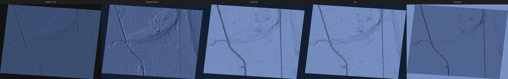
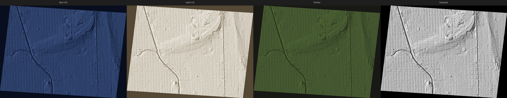
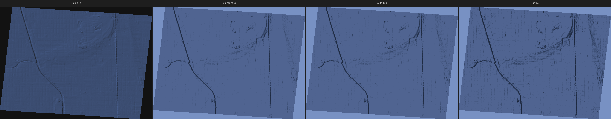
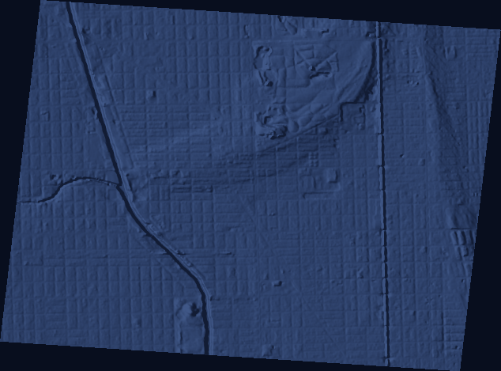
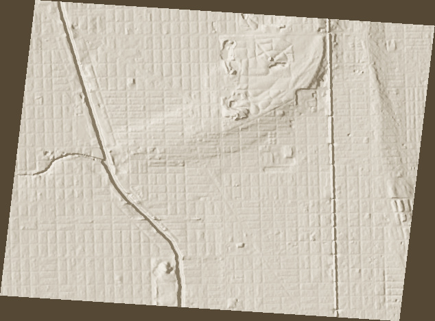
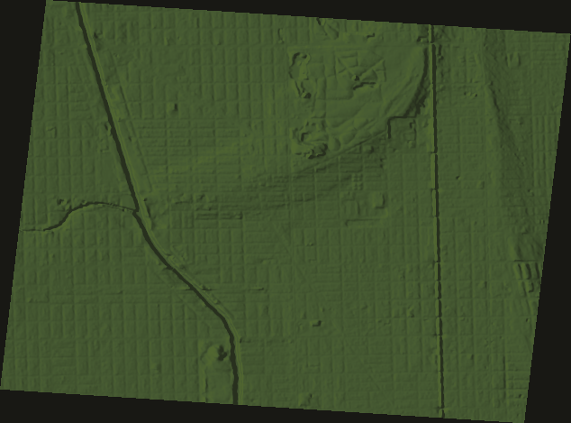
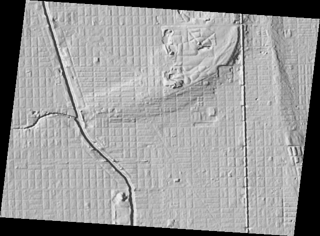

# ilhmp — Illinois Hillshade Map Generator

Download Illinois ILHMP elevation data and generate styled hillshade tiles for ATAK, web maps, and offline use.

**v2** adds advanced terrain rendering inspired by [Robert Simmon's GDAL shaded relief techniques](https://medium.com/@robsimmon/a-gentle-introduction-to-gdal-part-5-shaded-relief-ec29601db654): multi-directional shading, composite blending, auto-exaggeration, and named themes.

## Quick Start

```bash
pip install -e .

# Generate with a named theme
ilhmp run cook --theme atak-dark

# Or specify parameters directly
ilhmp run cook --dem dtm --style dark --shading multidirectional --zoom 10-16

# List available themes
ilhmp themes
```

## Themes

Themes are named presets that capture color ramp, shading mode, exaggeration, and other parameters. Use `--theme <name>` with any command.

| Theme | Shading | Color | Exagg | Best For |
|-------|---------|-------|-------|----------|
| **`atak-dark`** | multidirectional | blue-grey | auto | ATAK dark mode overlays |
| **`atak-light`** | multidirectional | warm grey | auto | ATAK light mode overlays |
| **`simmon`** | composite (60/30/10) | blue-grey | auto | Best overall terrain rendering |
| **`simmon-light`** | composite (60/30/10) | warm grey | auto | Light basemap composite |
| **`flat-terrain`** | composite (50/30/20) | blue-grey | 15× | Flat regions (IL, IN, FL) |
| **`mountain`** | composite (70/20/10) | blue-grey | 2× | Steep terrain (Rockies, Alps) |
| **`lidar-urban`** | composite (50/30/20) | blue-grey | 6× | 1m LiDAR in cities |
| **`lidar-natural`** | composite (60/30/10) | blue-grey | 9× | 1m LiDAR in rural areas |
| **`vivid`** | composite (50/30/20) | blue→green→orange→red | auto | Maximum feature contrast |
| **`cool`** | composite (50/30/20) | blue-grey desaturated | auto | Professional cartographic |
| **`vivid-elevation`** | composite (50/30/20) | vivid by height | auto | Elevation-mapped vivid |
| **`cool-elevation`** | composite (50/30/20) | blue-grey by height | auto | Elevation-mapped cartographic |
| **`tactical`** | multidirectional | olive drab | auto | Military-style maps |
| **`terrain`** | multidirectional | earth tones | auto | Topographic map style |
| **`grayscale`** | multidirectional | pure grey | auto | Base layer for custom coloring |
| **`classic`** | standard (315°) | tint blend | 3× | Legacy v1 behavior |

### Color Modes

Themes use one of three color modes:

| Mode | Description |
|------|-------------|
| **`ramp`** (default) | Maps hillshade brightness (0–255) to color. Shadows get one color, highlights another. |
| **`elevation`** | Maps DEM elevation to color, then modulates by hillshade for 3D effect. Ramp files use `0%`–`100%` notation that auto-scales to the DEM’s actual range. |
| **`tint`** | Legacy v1 single-color blend. |

Use `--color-mode elevation` or pick an elevation theme (`vivid-elevation`, `cool-elevation`).

### Theme Details

```bash
$ ilhmp themes --show simmon

simmon
   Advanced composite blend (60% multidirectional + 30% igor + 10% combined).
   Best overall terrain rendering, inspired by Robert Simmon's techniques.

   Parameters:
   Ramp:          dark
   Color mode:    ramp
   Shading:       composite
   Weights:       multi=0.6, igor=0.3, combined=0.1
   Exaggeration:  auto
   Terrain type:  auto
   Default zoom:  10-16
   Tags:          advanced, composite, dark

   Equivalent CLI:
   ilhmp run <county> --style dark --shading composite --color-mode ramp --exaggeration auto --composite-weights 0.6,0.3,0.1
```

### Visual Comparison

All examples below are from the **Summerdale neighborhood** in Chicago (2km around 41.9735°N, 87.6805°W) — extremely flat terrain (~18m total relief, stddev ~2m). This is the hardest case for hillshade rendering.

#### Shading Modes

All use dark color ramp at 9× exaggeration. Left to right: Classic v1 (3×, single-azimuth, tint blend), Multidirectional, Combined, Igor, Composite blend.



| Mode | Character | Best For |
|------|-----------|----------|
| **Classic** | Single light direction, simple | Legacy compatibility |
| **Multidirectional** | Even illumination from all angles | General-purpose default |
| **Combined** | Emphasizes slope and texture | Detail-heavy maps |
| **Igor** | Subtle, low-contrast | Layering with other data |
| **Composite** | Best of all three blended | Overall best rendering |

#### Themes

All themes use **multidirectional shading** with **auto exaggeration** (10× computed for this flat terrain):



#### Exaggeration

How vertical exaggeration affects flat terrain visibility:



| Exaggeration | Effect on Flat Terrain |
|-------------|------------------------|
| 3× (classic) | Subtle — terrain barely visible |
| 9× (composite) | Good balance for Illinois |
| 10× (auto) | Auto-computed from DEM statistics |
| 15× (flat-terrain) | Maximum detail — every creek and drainage visible |

#### Individual Theme Examples

| Theme | Preview |
|-------|---------|
| Dark (default) |  |
| Light (default) |  |
| Tactical |  |
| Grayscale |  |

#### Recommended Themes by Data Source

| Source | Resolution | Recommended Theme | Notes |
|--------|-----------|-------------------|-------|
| USGS 3DEP 1/3" | ~10m | `atak-dark` or `flat-terrain` | Good for z10-16 regional coverage |
| USGS 3DEP 1m LiDAR | 1m | `lidar-urban` (cities) or `lidar-natural` (rural) | Buildings provide natural contrast at 1m |
| ISGS County DEMs | 1ft (0.3m) | `lidar-urban` | Highest detail, biggest files |

## Shading Modes

### Standard
Classic single-azimuth hillshade (default 315° NW). Fast but can hide linear features aligned with the light source.

```bash
ilhmp run cook --shading standard --exaggeration 9
```

### Multidirectional (default)
Blends light from multiple angles clustered around 315°. Eliminates directional bias. Best general-purpose mode.

```bash
ilhmp run cook --shading multidirectional
```

### Combined
Emphasizes terrain texture and slope over directional lighting. Good for detail-heavy maps.

```bash
ilhmp run cook --shading combined
```

### Igor
Subtle, low-contrast shading designed to be layered with other data. Best used as part of a composite.

```bash
ilhmp run cook --shading igor
```

### Composite
Blends multiple shading algorithms with configurable weights. The `simmon` theme uses 60% multidirectional + 30% igor + 10% combined.

```bash
# Default weights
ilhmp run cook --shading composite

# Custom weights
ilhmp run cook --shading composite --composite-weights 0.5,0.3,0.2
```

## Auto-Exaggeration

When `--exaggeration auto` (or via a theme that uses auto), ilhmp:

1. Reads elevation statistics from the DEM (`gdalinfo`)
2. Computes base exaggeration to achieve ~40 gray levels of visual contrast
3. Applies a zoom-level scaling curve:

| Zoom | Scale Factor | Rationale |
|------|-------------|-----------|
| z0-6 | 0.4× | Continental overview — less exagg needed |
| z7-9 | 0.7× | State-level — moderate |
| z10-13 | 1.0× | County-level — full exagg |
| z14-16 | 1.2× | Neighborhood — slightly more for flat terrain |
| z17-19 | 0.6× | Street (LiDAR) — buildings provide contrast |
| z20+ | 0.4× | Parcel — back off further |

Override auto for specific terrain:
```bash
ilhmp run cook --exaggeration 15    # Fixed 15×
ilhmp run cook --theme flat-terrain  # Uses 15× preset
```

## Auxiliary Terrain Layers

Generate aspect, slope, roughness, and TRI (Terrain Ruggedness Index) layers:

```bash
ilhmp layers cook --dem dtm --output aspect,slope,roughness,TRI
```

These are useful for:
- **Aspect**: Solar exposure, vegetation analysis
- **Slope**: Steepness mapping, hazard assessment
- **Roughness**: Terrain texture, building detection from LiDAR
- **TRI**: Terrain ruggedness classification

## Color Ramps

Color ramps are GDAL `color-relief` format files in `ilhmp/ramps/`:

```
0 20 30 50 255        # shadow color (RGBA)
64 35 48 73 255
128 51 68 103 255     # midtone
192 80 100 145 255
255 120 145 195 255   # highlight color
nv 0 0 0 0            # nodata = transparent
```

Use a custom ramp:
```bash
ilhmp run cook --ramp my-custom-ramp.txt --color-mode ramp
```

### Legacy Tint Mode

v1 used a simple linear blend between background and tint colors. This is still available:

```bash
ilhmp run cook --color-mode tint --style dark   # v1 behavior
ilhmp run cook --theme classic                    # same thing
```

## Custom Themes

Save a theme to JSON:
```python
from ilhmp.themes import Theme, save_theme
from pathlib import Path

my_theme = Theme(
    name="my-special",
    description="Custom theme for my project",
    ramp="dark",
    shading="composite",
    composite_weights=(0.5, 0.3, 0.2),
    exaggeration="12",
    terrain_type="flat",
)
save_theme(my_theme, Path("my-theme.json"))
```

## Full Pipeline

### Generate locally

```bash
# Download → reproject → hillshade → tile (all-in-one)
ilhmp run cook --dem dtm --theme simmon --zoom 10-16

# With local DEM cache (avoids re-downloading)
ilhmp run cook --dem dtm --theme simmon --cache-dir ./cache

# Multiple themes from the same cached DEM
ilhmp run cook --theme atak-dark --cache-dir ./cache
ilhmp run cook --theme atak-light --cache-dir ./cache
ilhmp run cook --theme flat-terrain --cache-dir ./cache
```

### Generate on AWS EC2

Use [chimesh-tileserver](https://github.com/emuehlstein/chimesh-tileserver) for cloud generation:

```bash
# Spin up ARM64 worker, run all themes, upload to S3 + tile server
./generate-aws.sh cook --theme atak-dark,atak-light,flat-terrain

# List available themes
ilhmp themes
```

### Publish: PMTiles → exaggeratedrelief.com

Converts mbtiles to PMTiles, uploads to S3, updates catalog, opens PR:

```bash
ilhmp publish cook-atak-dark-z10-16.mbtiles --county cook --theme atak-dark
```

Served via CloudFront at `https://exaggeratedrelief.com` with PMTiles range requests.

### Push: mbtiles → tiles.exaggeratedrelief.com

SCPs the mbtiles to the tile server. mbtileserver auto-discovers it — no restart needed:

```bash
# Single file
ilhmp push cook-atak-dark-z10-16.mbtiles

# Whole output directory
ilhmp push-all ./output/cook/
```

Served as XYZ tiles at:
```
https://tiles.exaggeratedrelief.com/services/{name}/tiles/{z}/{x}/{y}.png
https://tiles.exaggeratedrelief.com/services/{name}/map   # preview
```

### Typical end-to-end

```bash
# 1. Generate
ilhmp run cook --theme atak-dark --zoom 10-16 --cache-dir ./cache

# 2. Push mbtiles to tile server
ilhmp push ./output/cook/atak-dark/cook-atak-dark-z10-16.mbtiles

# 3. Publish PMTiles to exaggeratedrelief.com
ilhmp publish ./output/cook/atak-dark/cook-atak-dark-z10-16.mbtiles \
    --county cook --theme atak-dark
```

## Installation

```bash
git clone https://github.com/emuehlstein/illinois-hillshade-gen.git
cd illinois-hillshade-gen
pip install -e .
```

### Requirements

- Python ≥ 3.10
- GDAL CLI tools (`gdaldem`, `gdalwarp`, `gdal2tiles.py`, `gdalinfo`)
- `mb-util` (for MBTiles packing)
- Optional: `pmtiles` CLI (for PMTiles output)
- Optional: GDAL Python bindings (faster color tinting)

## 102 Illinois Counties

```bash
ilhmp counties          # list all
ilhmp counties --json   # machine-readable
```

Data sourced from the [Illinois Height Modernization Program (ILHMP)](https://clearinghouse.isgs.illinois.edu/data/elevation) via the Illinois State Geological Survey.

## License

MIT
