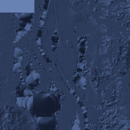
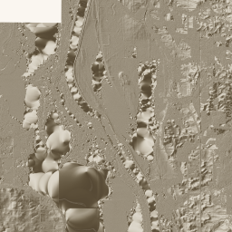
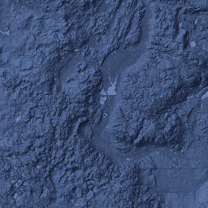
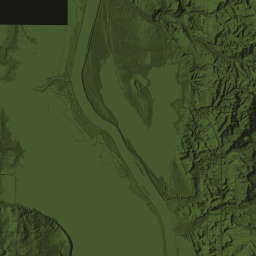
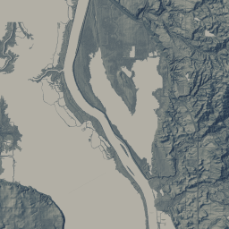
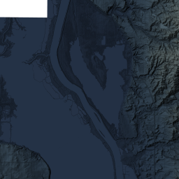
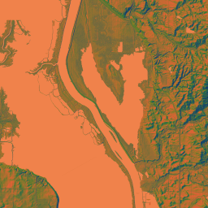
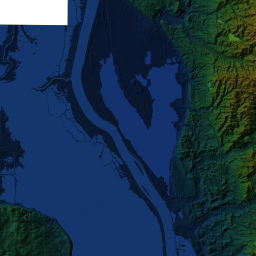
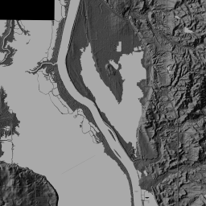

# Putnam County — Theme Samples

Putnam County, Illinois (FIPS 17155) — one of the smallest counties in Illinois, 
centered on the Illinois River valley. Good test case: mixed flat/moderate terrain.

**Source:** USGS ILHMP DTM (2022), 1ft (0.3m) resolution  
**Zoom:** z9–16  
**Tile shown:** z12 / ~41.21°N, 89.32°W (Illinois River corridor)

---

## Theme Gallery

| Theme | Sample (z12) | Preview Map | PMTiles |
|-------|-------------|-------------|---------|
| `atak-dark` |  | [preview](https://tiles.chicagooffline.com/services/putnam-hillshade-dark/map) | [putnam-atak-dark-9x.pmtiles](https://exaggeratedrelief.com/tiles/putnam-atak-dark-9x.pmtiles) |
| `atak-light` |  | [preview](https://tiles.chicagooffline.com/services/putnam-hillshade-light/map) | [putnam-atak-light-autox.pmtiles](https://exaggeratedrelief.com/tiles/putnam-atak-light-autox.pmtiles) |
| `simmon` |  | — | [putnam-simmon-autox.pmtiles](https://exaggeratedrelief.com/tiles/putnam-simmon-autox.pmtiles) |
| `simmon-light` |  | — | [putnam-simmon-light-autox.pmtiles](https://exaggeratedrelief.com/tiles/putnam-simmon-light-autox.pmtiles) |
| `flat-terrain` |  | — | *(not yet on S3 — push ExtSSD when mounted)* |
| `tactical` |  | [preview](https://tiles.chicagooffline.com/services/putnam-tactical-z9-16/map) | [putnam-tactical-autox.pmtiles](https://exaggeratedrelief.com/tiles/putnam-tactical-autox.pmtiles) |
| `cool` |  | — | [putnam-cool-z9-16.pmtiles](https://exaggeratedrelief.com/tiles/putnam-cool-z9-16.pmtiles) |
| `cool-elevation` |  | [preview](https://tiles.chicagooffline.com/services/putnam-cool-elevation-z9-16/map) | [putnam-cool-elevation-z9-16.pmtiles](https://exaggeratedrelief.com/tiles/putnam-cool-elevation-z9-16.pmtiles) |
| `vivid` |  | — | [putnam-vivid-z9-16.pmtiles](https://exaggeratedrelief.com/tiles/putnam-vivid-z9-16.pmtiles) |
| `vivid-elevation` |  | [preview](https://tiles.chicagooffline.com/services/putnam-hillshade-vivid-elev/map) | [putnam-vivid-elevation-z9-16.pmtiles](https://exaggeratedrelief.com/tiles/putnam-vivid-elevation-z9-16.pmtiles) |
| `grayscale` |  | [preview](https://tiles.chicagooffline.com/services/putnam-hillshade-gray/map) | [putnam-grayscale-autox.pmtiles](https://exaggeratedrelief.com/tiles/putnam-grayscale-autox.pmtiles) |

> **Note:** `flat-terrain` sample shown is from McHenry County (same theme, similar flat IL terrain).  
> Preview links use `tiles.chicagooffline.com` (legacy tile server) for themes already hosted there.  
> All PMTiles are served via CloudFront at `https://exaggeratedrelief.com/tiles/`.

---

## XYZ Tile Endpoints

For the themes hosted on the tile server:

```
https://tiles.chicagooffline.com/services/putnam-hillshade-dark/tiles/{z}/{x}/{y}.png
https://tiles.chicagooffline.com/services/putnam-hillshade-light/tiles/{z}/{x}/{y}.png
https://tiles.chicagooffline.com/services/putnam-tactical-z9-16/tiles/{z}/{x}/{y}.png
https://tiles.chicagooffline.com/services/putnam-cool-elevation-z9-16/tiles/{z}/{x}/{y}.png
https://tiles.chicagooffline.com/services/putnam-hillshade-vivid-elev/tiles/{z}/{x}/{y}.png
https://tiles.chicagooffline.com/services/putnam-hillshade-gray/tiles/{z}/{x}/{y}.png
```

Once pushed to `tiles.exaggeratedrelief.com` via `ilhmp push`, endpoints will be:

```
https://tiles.exaggeratedrelief.com/services/putnam-{theme}-z9-16/tiles/{z}/{x}/{y}.png
```

---

## Regenerate

```bash
ilhmp run putnam --theme atak-dark --zoom 9-16
ilhmp run putnam --theme simmon --zoom 9-16
# ... etc
```

Or all themes at once on EC2:

```bash
./generate-aws.sh putnam --theme all
```
